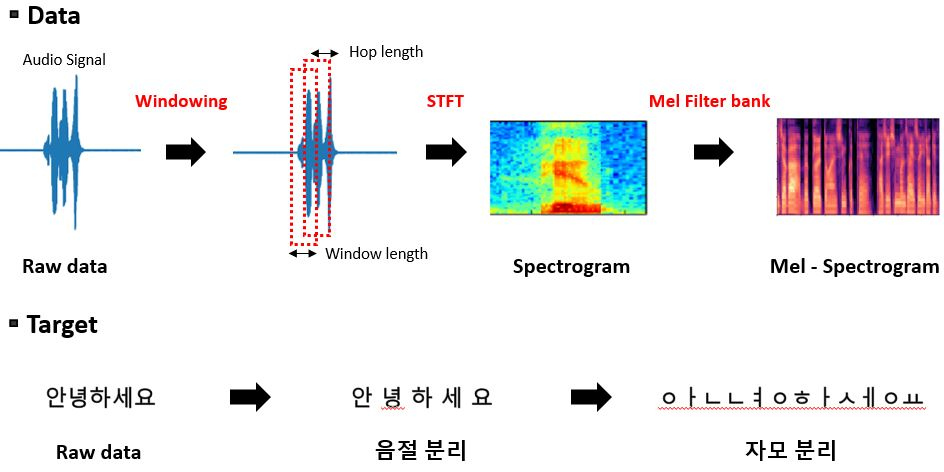
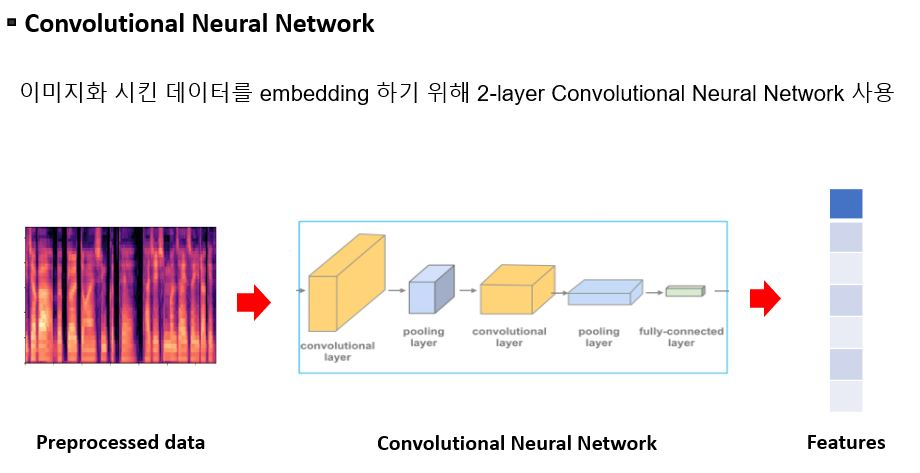
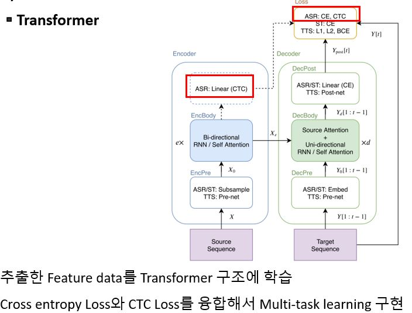
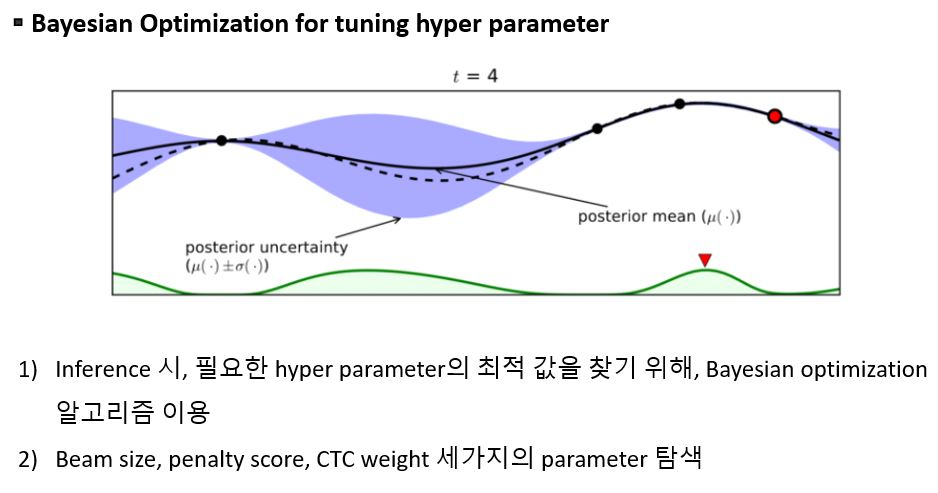
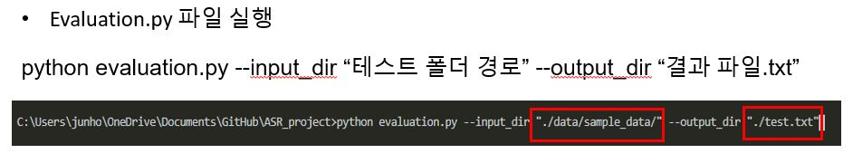

# ASR_project
This repository created for ASR Hackathon Competition. 

We won the Excellence award in NHN Consortium 2020 AI Training Data Hackathon Competition
http://hackathon.workpedia.co.kr/

## Requirements
```
pip install chainer
pip install hgtk
pip install python-Levenshtein
pip install typeguard
pip install librosa
pip install configargparse
pip install torch_complex
pip install pytorch_wpe
pip install humanfriendly

conda install editdistance
```

## Total progress

1) Preprocess the dataset

2) Models


3) Hyper Parameter Optimize

## Results

## Usage

