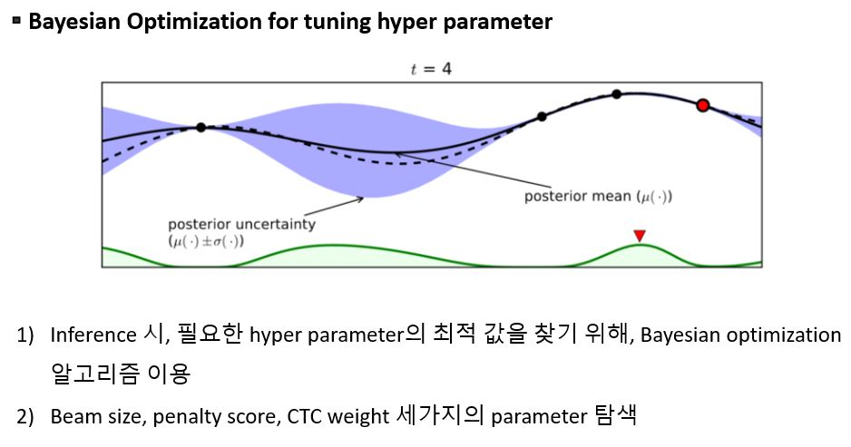

# ASR_project
This repository created for ASR Hackathon Competition. 

We won the Excellence award in NHN Consortium 2020 AI Training Data Hackathon Competition
http://hackathon.workpedia.co.kr/


## Dataset inforamtion
Training data information is as follows
NHN ASR hackerthon dataset (not publicly available now)
Voice data types consist of men and women(adult, senior, children, foreign languages).
It is free-talk voice data(total of 200 speakers and approximately 400 hours of data).
The PCM data information is 16 kHz, one channel, and 16 bits.


## Requirements
```
pip install chainer
pip install hgtk
pip install python-Levenshtein
pip install typeguard
pip install librosa
pip install configargparse
pip install torch_complex
pip install pytorch_wpe
pip install humanfriendly

conda install editdistance
```

## Total progress

### 1) Preprocess the dataset


### 2) Models

#### Encoding


#### Transformer model


### 3) Hyper Parameter Optimize

We used bayesian optimization to find optimal beam size, penalty score, and CTC weight to inference model



## Results

We achieve the 4.5 CER in NHN ASR hackerthon dataset (not publicly available now)

### 1) Our Dataset
|Dataset|number of dataset|CER|
|------|---|---|
|Validation|-|5.2|
|Test|-|5.5|

### 2) Test Samples
|Dataset|number of dataset|CER|
|------|---|---|
|Test|-|14.5|


## Usage

Input data folder samples are in data folder.
```
#input_data_path : folder
#output_data_path : txt file
python evaluation --input_dir "input_data_path" --output_dir "output_data_path"
```

